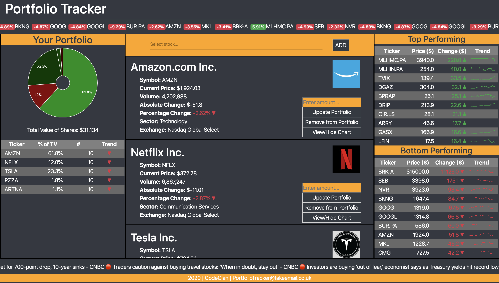

# Portfolio Tracker
## Week 9 Group Project @ CodeClan
### (Feb 27, 2020 - March 5, 2020)

Portfolio Tracker app allows you to select a number of stocks from NASDAQ stock exchange, add them to your portfolio and track your total portfolio value in real-time.

The project is built using:
* HTML / CSS
* JavaScript
* Vue.js (front-end)
* MongoDB (back-end)
* Additional libraries used: Vue CLI, Express, HighCharts, G-Charts, SyncFusion, Marquee, Bootstrap
The application is using Financial Modeling Prep API as a source of stock data: https://financialmodelingprep.com/developer/docs/

## User interaction / journey
#### Search a stock
Start by searching for a stock either by its ticker or by the name of the company that issued the stock. Select a stock of your choice and click "ADD" button to add the stock to your List of Stocks. The List of Stocks shows you basic information for each stock as well as an option to view a chart portraying 1-year price history (click View/Hide chart). 

#### Add/Update/Delete a stock from your portfolio
Add a stock from your List of Stocks to your portfolio by supplying the number of shares you wish to add and clicking the "Add to Portfolio" button. Proceed similarly if you want to update or delete a stock from your Portfolio. Refresh the page for your actions to take effect. Your portfolio composition and portfolio breakdown will update.

#### Your Portfolio
Your Portfolio section on the left displays the composition of your portfolio and the total value of your portfolio at any given point in time. The portfolio breakdown table below the pie chart summarizes the basic properties of your portfolio. The Trend column compares the purchase price (i.e. the sotck price as of clicking the "Add to Portfolio" button) with the current price (updated each minute).

#### Best/Least performing stocks
To help user with stock analysis, the application displays the top and bottom performing stocks of the previous day. For each stock on the list, sparklines are available to show the price trend for the latest 43 trading days.

#### Other
* Marquee on the top of page shows the most active stocks and their daily percentage changes. 
* Marquee at the bottom of the page shows the latest business-related news to help the user to gain awareness of the industry hot topics.

## Project Brief (as given by CodeClan):
Build a Shares Portfolio Application. A local trader has come to you with a portfolio of shares. She wants to be able to analyse it more effectively. She has a small sample data set to give you and would like you to build a Minimum Viable Product that uses the data to display her portfolio so that she can make better decisions.

#### Minimum Viable Product requirements (MVP):
A user should be able to:
* view total current value.
* view individual and total performance trends.
* retrieve a list of share prices from an external API and allow the user to add shares to her portfolio.
* View a chart of the current values in her portfolio.

#### Example Extensions
Speculation based on trends and further financial modelling using projections.

## Set up / Running the project
##### Front-end (client)
* npm install
* npm run serve
* The application will run on 8080 localhost.
##### Back-end (server):
* npm install 
* npm run server:dev
* Server will run on 3000 local host.

## Attachment - Presentation Slides
